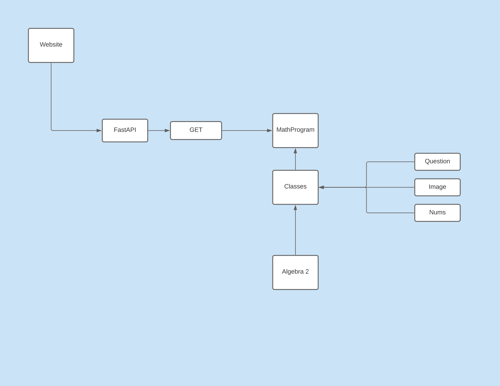

# MathPro

MathPro is a powerful python library for generating math questions.

## Mission Statement

To be a large contributor to the growing wealth of resources for online education during the COVID-19 pandemic.

## Goals

To be updated.

## Notes

1) The documentation is available at *MathProgram/docs.html*. You will find the installation process here.
2) If you're spending more than 15 minutes trying to solve an error, please ask for help.

## Special Notes

Nelson Lojo contributed the QuestionGenerator class, which streamlines the process of generating questions from prewritten templates.

**Current Project Contributers**:

Nima Rahmanian, Daniel Etaat, Gianni Gabriel, Matthew Chorlain, Quang (David) Nguyen, Rohan Tibrewal, Guy Eustace, Sonia Chacon, Divyam Goel, 
Nolan Doyle, Divya Kunisetty, Thao Le, Tanay Baswa, Jonathan Meshkanian.
